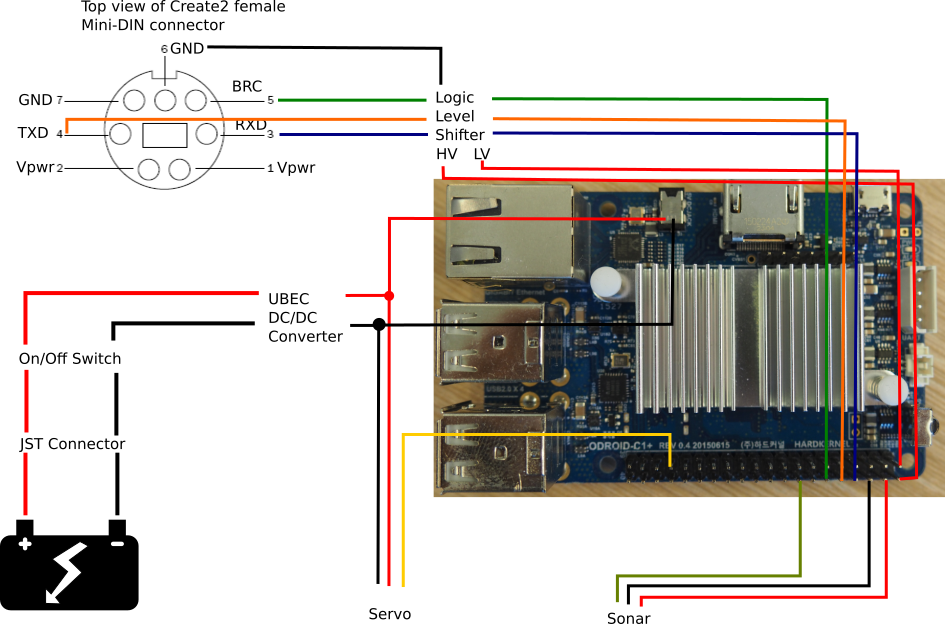

.. _hardware:

Hardware
========

Components
----------

(prices in USD and links as of spring 2016)

.. csv-table:: Part List
   :header: "Name", "Link", "Distributor", "Price", "Notes"

   "iRobot Create2","https://www.adafruit.com/products/2388","Adafruit",199.99,
   "Mini-DIN Connector Cable for iRobot Create 2 - 7 Pins - 6 feet","https://www.adafruit.com/products/2438","Adafruit",6.95,
   "4-channel I2C-safe Bi-directional Logic Level Converter - BSS138","https://www.adafruit.com/products/757","Adafruit",3.95,
   "UBEC DC/DC Step-Down (Buck) Converter - 5V @ 3A output","https://www.adafruit.com/products/1385","Adafruit",9.95,
   "Rugged Metal On/Off Switch with Green LED Ring - 16mm Green On/Off","https://www.adafruit.com/products/482","Adafruit",4.95,
   "Silicone Cover Stranded-Core Wire - 25ft 26AWG - Red","https://www.adafruit.com/products/2513","Adafruit",4.95,"For several Robots"
   "Silicone Cover Stranded-Core Wire - 25ft 26AWG - Black","https://www.adafruit.com/products/2517","Adafruit",4.95,"For several Robots"
   "Premium Female/Female Jumper Wires - 40 x 6""","https://www.adafruit.com/products/266","Adafruit",3.95,"For several Robots"
   "Multi-Colored Heat Shrink Pack - 3/32"" + 1/8"" + 3/16"" Diameters","https://www.adafruit.com/products/1649","Adafruit",4.95,"For several Robots"
   "Panel Mount USB Cable - A Male to A Female","https://www.adafruit.com/products/908","Adafruit",3.95,
   "Odroid C1+","http://ameridroid.com/products/odroid-c1","AmeriDroid",38.95,
   "WiFi Module 3","http://ameridroid.com/products/wifi-module-3","AmeriDroid",9.95,
   "DC Plug and Cable Assembly 2.5mm L-Type","http://ameridroid.com/products/dc-plug-and-cable-assembly-2-5mm-l-type","AmeriDroid",1.95,
   "Aluminum Standoff: 1/2"" Length, 4-40 Thread, F-F (4-Pack)","https://www.pololu.com/product/2091","Pololu",1.39,"For 2 robots each"
   "Machine Screw: #4-40, 1/4"" Length, Phillips (25-pack)","https://www.pololu.com/product/1960","Pololu",0.99,"For up to 12 robots each"
   "Machine Screw: #4-40, 5/16"" Length, Phillips (25-pack)","https://www.pololu.com/product/1961","Pololu",0.99,"For up to 12 robots each"
   "JST RCY Connector Pack, Female","https://www.pololu.com/product/1934","Pololu",1.75,"For up to 3 robots each"
   "JST RCY Connector Pack, Male","https://www.pololu.com/product/1935","Pololu",1.75,"For up to 3 robots each"
   "Parallax Standard Servo","https://www.parallax.com/product/900-00005","Parallax",12.99,"Optional"
   "PING))) Ultrasonic Distance Sensor ","https://www.parallax.com/product/28015","Parallax",29.99,"Optional"

Wiring
------

